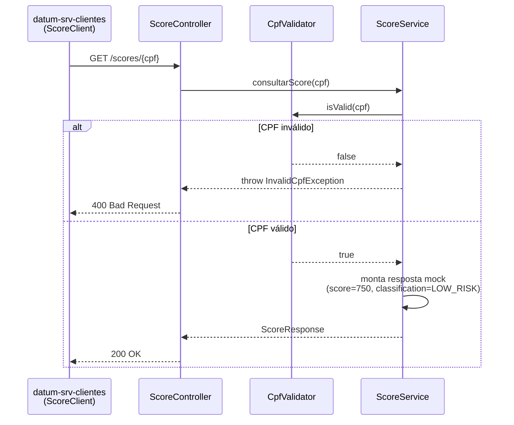
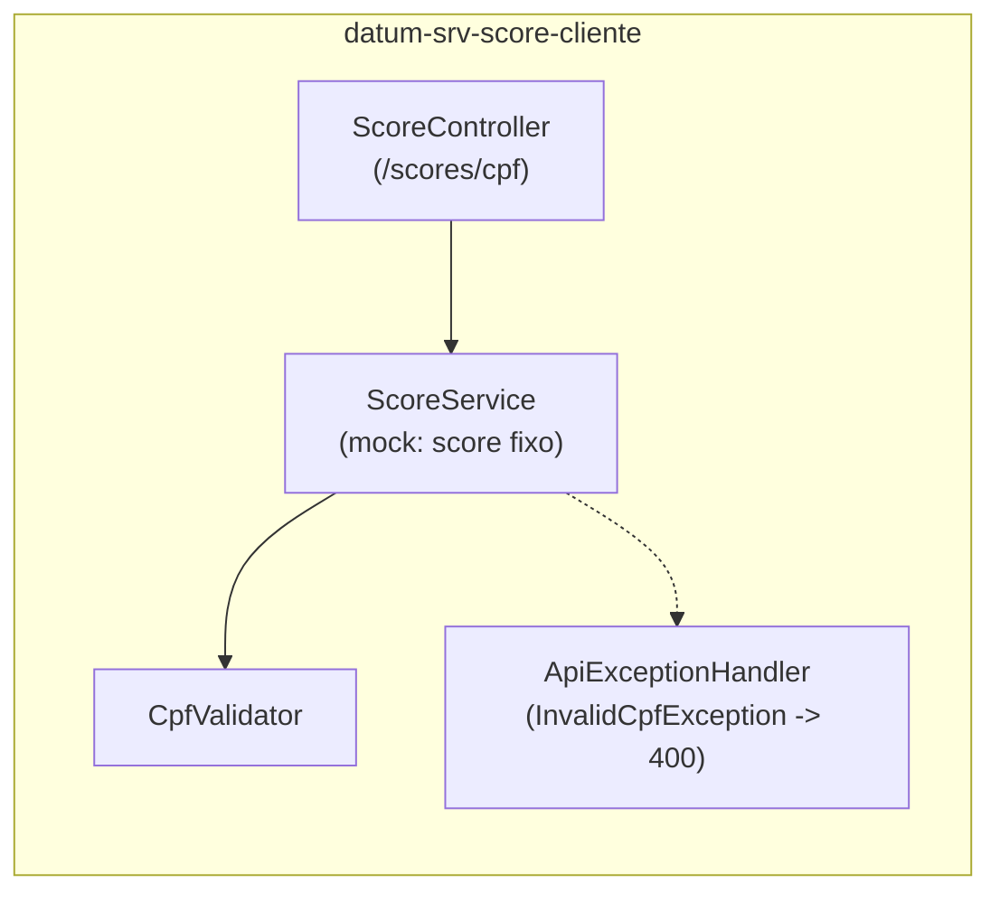

# datum-srv-score-cliente

Serviço de consulta de score de clientes por CPF, da stack **Datum**.

## Função do serviço

O `datum-srv-score-cliente` expõe um único endpoint (`GET /scores/{cpf}`) que retorna o score e a classificação de risco de um CPF. Ele:

- **Valida o CPF** recebido (11 dígitos, descarta sequências repetidas como `00000000000`, confere os dois dígitos verificadores pelo algoritmo oficial da Receita Federal). CPF inválido retorna `400 Bad Request` com uma mensagem padronizada.
- **Retorna o score**: a implementação atual é um **mock** — sempre devolve o mesmo score (`750`) e a mesma classificação (`LOW_RISK`), ecoando o CPF recebido. Não há integração com um bureau de crédito real nem persistência.

Este serviço é consumido internamente pelo `datum-srv-clientes` (endpoint `GET /customers/{id}/score`), mas não conhece nem depende dele — é uma API HTTP simples e desacoplada.

## Tecnologias

| Categoria | Tecnologia |
|---|---|
| Linguagem / runtime | Java 21 |
| Framework | Spring Boot 3.5.16 |
| Web | Spring Web (REST) |
| Build | Maven (via `mvnw`) |
| Empacotamento / execução | Docker (build multi-stage `eclipse-temurin:21-jdk`) |
| Testes | Spring Boot Test |

Não usa Spring Security, Spring Data/JPA nem Spring AMQP — é o serviço mais simples da stack, sem estado e sem dependências externas em tempo de execução.

## Dependências (serviços necessários para funcionar)

Nenhuma. O `datum-srv-score-cliente` é **stateless** e **autossuficiente**: não usa banco de dados, não publica/consome filas e não valida token de autenticação. Sobe isoladamente, sem `depends_on` no `docker-compose.yml`.

> Observação: por não validar Access Token, o endpoint fica exposto sem autenticação própria. Na stack atual isso é aceitável porque o serviço só é chamado internamente pelo `datum-srv-clientes`, mas a porta `8090` também é publicada no host — vale considerar autenticação/rede restrita antes de um cenário de produção real.

## Arquitetura

### Endpoint

| Método | Caminho | Resposta |
|---|---|---|
| `GET` | `/scores/{cpf}` | `200 OK` com `{ cpf, score, classification }`, ou `400 Bad Request` se o CPF for inválido |

### Fluxo de consulta



### Componentes internos



- `Classification`: enum com os valores `LOW_RISK`, `MEDIUM_RISK`, `HIGH_RISK` — hoje só `LOW_RISK` é retornado pelo mock.
- Evoluir este serviço para consultar um provedor de score real substituiria apenas `ScoreService`, sem impacto no contrato do endpoint nem nos demais serviços da stack.

## Como subir

Este serviço faz parte da stack orquestrada pelo `docker-compose.yml` na raiz do repositório [`projeto-datum`](https://github.com/alexmart001/projeto-datum). Por não ter dependências, pode subir sozinho:

```bash
docker compose up datum-srv-score-cliente
```
